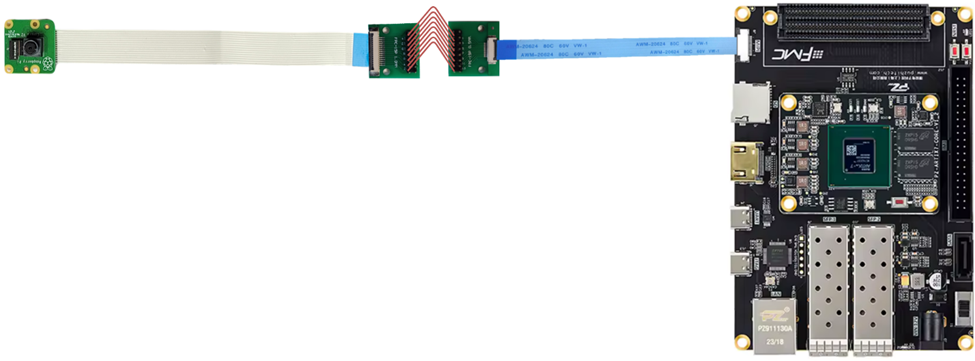

## FPGA-ISP-UVC-USB2 Project

   
   

### Project Overview 

The **USB UVC project** is designed to create an innovative and adaptable webcam that easily connects to any laptop, providing **high-quality video without the need for special drivers**. Unlike ordinary USB webcams that often come with proprietary software and limited functionality, this project aims to deliver a flexible, open-source solution that can be tailored and improved by anyone. The webcam will offer superior video quality with features like automatic brightness adjustment, color correction, and real-time video compression, making it ideal for video calls, streaming, and other visual applications. By focusing on open-source principles, this project ensures that the technology is accessible, modifiable, and transparent, allowing for continuous community-driven enhancements. 

The technical objective of the project is to capture MIPI CSI2 image data from image sensors—specifically the `Sony IMX219` and `OmniVision OV2740`—along with audio from a microphone. The system will transmit both video and audio streams to a USB host (e.g., a PC) via a **USB 2.0 interface**. 

Before transmission, the image data will undergo basic processing, such as:
- Auto white balance
- Color correction
- Gamma correction

To reduce bandwidth requirements between the FPGA and the USB interface, the processed images will be **JPEG-compressed**. The final output will consist of two separate (unsynchronized) **audio and video streams**, delivered over USB 2.0 to the host device. 

#### About OpenEye

The flow of the original Openeye project is described in [this block diagram](/0.doc/FPGA-Block-Diagram.png).  

Important modules include: 

- `i2c`, which writes the configuration of the I2C registers, so that the sensor can start up and be tuned to the desired settings.  

- `csi_rx`, which is responsible for the transmission of the data from the sensor through the MIPI interface. 

- `isp`, which currently includes only the module `raw2rgb`, which translates raw data (received from MIPI) to RGB pixel data (represented with 8 bits). The Simple Color Balance algorithm will be instantiated here soon.

- `rgb2hdmi` includes an ASYNC fifo which buffers each line and sends the data to HDMI.

- `hdmi_top` which configures the data transmission through HDMI.

## Objective I 
### Validate Basic development hardware Setup 

The target of this part is to validate and familiarize with the implementation provided by https://github.com/chili-chips-ba/openeye-CamSI/tree/main with `2-lane RPiV2.1`, based on `Sony IMX219`. 

#### Used Hardware 

- 2-lane RPiV2.1, based on Sony IMX219 sensor 

- PuZhi PZ-A7100T Starlite Evaluation Kit Xilinx Artix-7 XC7A100T FPGA Development Board Core Board MIPI

   

   

#### Connectivity Incompatibility

The `Puzhi PZ-A7100T Starlite Evaluation Kit` features a **0.5 mm-pitch CSI (Camera Serial Interface) connector**, whereas the `Raspberry Pi` camera module uses a **1.0 mm FFC (Flat Flexible Cable) pitch**. 

To resolve this, a **pitch adapter or a custom interposer board** is typically required, adding design complexity and potential signal integrity concerns. This highlights the importance of verifying interface compatibility early in the hardware development process to avoid costly rework or integration issues. 

   

To bridge the pitch mismatch between the `Raspberry Pi` camera module and the `Puzhi PZ-A7100T Starlite Evaluation Kit`, we employ a **two-stage breakout solution**:
- The first breakout board accepts the camera's `1.0 mm-pitch FFC` and breaks out the CSI signals to accessible headers or pads.
- The second board receives these signals and routes them to a `0.5 mm-pitch FFC connector` compatible with the FPGA’s CSI interface. 

While this solution enables interconnection without custom PCB design, it introduces additional signal routing, which may affect signal integrity. Careful consideration of trace length, impedance matching, and shielding is necessary to maintain CSI signal quality. 

   
   
   

The following pictures show an overview of the entire setup: 

   

   

**Investigated Resolutions:**

- [x] 1280x720p @ 60Hz
- [x] 1920x1080p @ 30Hz
- [x] 1920x1080p @ 60Hz (Not Supported)

The resolution can be chosen in the file [top_pkg.sv](/1.hw/top_pkg.sv).

#### 1280x720p @ 60Hz

After setting up the hardware connection, the first resolution could be tested straight away, as it was already configured and validated by the original contributors. 

We encountered a visual bug, that caused the visible screen to be split by a vertical line, start from the middle and then wrap around. We had to perform a hack in the code of the HDMI backend module to overcome this issue, which might be caused either from monitor inconsistency or from an original oversight on the HDMI module. 

   

During our debugging efforts, we familiarized ourselves with the I2C register configuration, explained in the [IMX219 manual](https://www.opensourceinstruments.com/Electronics/Data/IMX219PQ.pdf). Multiple registers are set, including:

- `0x0301` - `0x030d`, which are associated with the clock network of IMX219 and have to be set correctly to achieve the required frequencies for the MIPI clock and pixel clock.
- `0x0160-0161` and `0x0162-0163`, which set the frame length (in lines) and the line length (in pixels) that the sensor reads. The line length is, by default, 3448 pixels.
- `0x0164` - `0x016b`, which set the starting and ending horizontal and vertical points of the visible pixel data.
- `0x016c-016d` and `0x016e-016f`, which set the width and height of the image data output from the sensor.

According to the [video timings calculator](https://tomverbeure.github.io/video_timings_calculator), 720p60 requires a pixel clock of 74.25MHz. The total horizontal length on the HDMI side must be `1650` and the vertical length must be `850`. However, a custom configuration is used in this project, causing the pixel clock to be **86.11MHz**, and the horizontal HDMI blanking to be `1687` instead. 

The following equation is satisfied:

$$
\frac{86.11 \text{MHz}}{1687 \times 850} = 60fps
$$

On the I2C side, the numbers are a little different, as the values of the registers `frame_length_lines` and `line_length_pck` are used in this equation. Furthermore, a different clock frequency is used (**88MHz**) and, because the IMX219 sensor uses 2 lanes, it must be multiplied by two, leading to the following equation:

$$
\frac{2 \times 88 \text{MHz}}{3448 \times 850} = 60fps
$$

It should be noted that the sensor can be configured via I2C to show a **test pattern** image rather than the camera input. This can easily be toggled by setting the register `0x0601` to have the value `2` instead of `0`.

The testing was successful, as shown below. A visible issue is the overly green color of the video output. We assume that this has to do with the sensor, and that it will be fixed by our color balancing module.

   

  

#### 1920x1080p @ 30Hz

In contrast to 720p60, 1080p30 was not already validated and configured by the original contributors, therefore we had to implement it from scratch. This was a task that required time and effort, mostly on understanding the I2C and HDMI timing settings for 720p60 and figuring out how they must change for 1080p30.

Once again, even though the default pixel clock for 1080p30 is 74.25MHz, a custom configuration is utilized, so its value is actually **86.11MHz**. The default vertical length on the HDMI side is `1125`. The default horizontal length is `2200`, but we change it to `2553` to support the new pixel clock and satisfy the equation for 30fps:

$$
\frac{86.11 \text{MHz}}{2553 \times 1125} = 30fps
$$

A new pixel clock of **58MHz** was chosen for the I2C configuration, so that it can keep up with the required resolution and frame rate:

$$
\frac{2 \times 58 \text{MHz}}{3448 \times 1125} = 30fps
$$

An unexpected issue we faced was monitor incompatibility. Through our testing sessions, we tried three different monitors
- The first supported 720p60 but not 1080p30.
- The second supported 1080p30 but not 720p60.
- The third supported both.

Video streams were eventually displayed with success:

   

  

#### 1920x1080p @ 60Hz

When it comes to 1080p60, we conclude that it cannot be satisfied because the frequency that it requires exceeds the maximum frequency that can be produced by the MMCM / PLL modules in the FPGA. 

#### Memory and Bandwidth restrictions

In the HDMI side, there is a **FIFO** used, to buffer each line, because storing the entire frame (1280 * 720 * 24 bits  or 1920 * 1080 * 24 bits) is unfeasible due to FPGA memory restrictions. Using this FIFO helped us transmit the image through the HDMI module and display it successfully.

We experienced no problems with the MIPI bandwidth, as our data rate was measured to be below the theoretical upper bound of 2.5Gbits/sec:

| Resolution | Horizontal Pixels | Vertical Pixels | Bits per Pixel | Frame Rate | Per Lane | Data Rate |
|------------|-------------------|-----------------|----------------|------------|----------|-----------|
| 720p60     | 1280              | 720             | 24             | 60         | 1/2      | 0.663 GB/s|
| 1080p30    | 1920              | 1080            | 24             | 30         | 1/2      | 0.746 GB/s|

---

## Objective II 
### Implement and Validate ISP (Image Signal Processing) Block
**Simple Color Balance** IP Block available software code was available from https://www.ipol.im/pub/art/2011/llmps-scb/?utm_source=doi. 

#### Algorithm Overview

A hardware implementation must work with “live” images, i.e. groups of pixels per frame, flowing through an image pipeline. The hardware implementation of the *SCB* thus works on a frame by frame basis, correcting the colours of frame `n` in frame `(n + 1)`. The gap between frames is sufficient to compute the colour balance frame ratios, i.e. 
`frameratio = 255/(max RGB – min RGB)` per RGB channel, using dividers. Then, colours are balanced “live”, during frame `(n + 1`), by multiplying the input pixel colour `i` by `(i – min) x frameratio`.

#### Behavioral Experiments

The pixel clock frequency of `86.11MHz` is sufficient to perform multiplications “live”, as pixels come in and go out through the SCB IP Block. This was checked using post-PNR simulations in **Vivado** as both timing was closed for the design and entire images were validated to be balanced correctly.

In the following two figures which were used during behavioral testing, the effect of the *SCB* algorithm can be seen. On the left is the original image, which appears to be faded out, and on the right is the balanced image, which appears brighter and livelier, due to the color balancing:

  
&nbsp; &nbsp; &nbsp; &nbsp;
  

Similarly, an artificial sequence of frames that represents a video, can be displayed in the following figures. The range of the RGB values changes from frame to frame, and the *SCB* algorithm tries to balance them, based on each previous frame.
- Input Frames:

  
   
   
   
   

- Output Frames:

  
   
   
   
   

In the screenshot below, the processing of one of the frame lines is shown. Previously, one identical frame has already been loaded, to configure the min-max ranges. In the input frame, all RGB values are within the range `[64, 196]`, so the SCB algorithm translates them to the range `[0, 255]`, with minor precision inaccuracies that do not have a large visible impact. The balancing is performed using multipliers which have a single cycle delay, thus this algorithm converts each frame with a single-cycle delay.

  

#### Experiments on FPGA

The testcases examined in the above section, albeit properly functional, do not accurately reflect the image processing of a video stream captured by a sensor such as IMX219. Due to the way that the sensor captures each frame, the color ranges may not always range in `[0, 255]`, which is the reason why the HDMI output shown in **Objective I** had a visible shade of green. This is also shown clearly in the video below:

  

The **Simple Color Balance** algorithm manages to remove this green shade and restore the pixels to a value that is much closer to their real color, as shown in the video below:

  

The difference in brightness and color scaling is evident in the frame comparison below:

  
  

#### Advantages of the Simple Color Balance Algorithm
- It is **easy to implement**, as the mathematical equations used are rather simple and easy to be expressed in hardware.
- It **does not require a different (faster) clock** than the pixel clock already used (`86.11MHz`). This is really important because other parts of the MIPI to HDMI flow require clocks of different frequencies, causing CDCs to rise as a potential concern.
- It **does not consume many LUTs** or many FPGA resources in general. Only `1.31%` of our PUZHI board were required, and no instance of more crucial resources such as BRAMs
- It is a "straight-through" module, meaning that **no frames are lost** and **no structure such as a FIFO is required** to forward the related signals.

#### Disdvantages of the Simple Color Balance Algorithm
- It is **sensitive to light**, meaning that the balancing is suboptimal when a source of light appears in the capture.
- As it performs color balance on a frame-by-frame level, subtle differences between the frames can have a negative impact on the visual outcome.

### Upcoming:
   - [X] Validate Basic Development Hardware Setup

   - [X] Implement and Validate ISP (Image Signal Processing) Block 

   - [ ] Implement and Validate JPEG Module and Audio core 

   - [ ] Implement and Validate USB2.0 Module 

   - [ ] Put together and Demonstrate working MIPI-JPEG-USB FPGA System 
